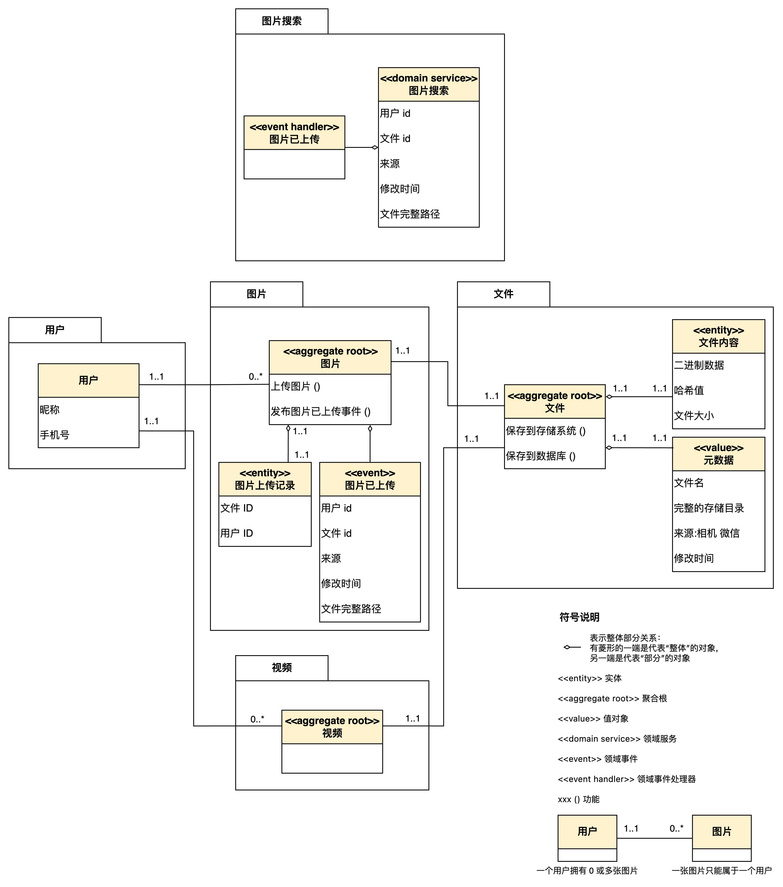

# AOE Media Server

<style>
.center {
    text-align: center;
}
</style>

<p class="center">
  <a href="https://app.codecov.io/gh/aoeai/aoemedia-server/tree/main">
    
  </a>
</p>

基于领域驱动设计「DDD」的多媒体文件存储系统。支持存储各种图片。

## 项目背景

备份手机照片：将 Android 手机拍摄的照片传输至本地电脑存储。

## 项目结构

```
├── adapter                  # 适配器层
│   └── driving             # 驱动适配器
│       └── restful         # RESTful API 接口
│           └── upload      # 上传控制器
├── application             # 应用层
│   └── storage             # 存储服务
│       └── path           # 路径管理
├── common                  # 公共组件
│   ├── os                 # 操作系统相关
│   └── test*              # 测试工具
├── config                  # 配置管理
│   └── *.toml             # 环境配置文件
└── domain                  # 领域层
    ├── file               # 文件领域
    │   ├── model          # 文件模型
    │   └── storage        # 文件存储接口
    └── image              # 图片领域
        ├── model          # 图片模型
        └── storage        # 图片存储接口
```

## 领域模型



## 核心功能

### 文件存储
- 文件上传：支持多种类型文件上传
- 图片上传：支持图片格式校验和内容校验

### 图片处理
- 图片存储：按时间自动分类存储，支持EXIF信息提取
- 图片验证：支持图片格式和内容合法性校验

## 技术栈

### 后端框架
- Go 1.21：利用最新特性提升性能和开发效率
- Gin Web Framework：高性能HTTP Web框架

### 开发方法论
- 测试驱动开发「TDD」：保证代码质量和可维护性，支持即时重构，测试即文档
- 领域驱动设计「DDD」：合理划分业务边界，提高代码可维护性

## 环境配置

项目支持多环境配置，配置文件位于`config`目录：
- `config.dev.toml`：开发环境配置
- `config.test.toml`：测试环境配置
- `config.prod.toml`：生产环境配置

## 开发指南

### API 接口

[文档地址](https://apifox.com/apidoc/shared-e09cdfae-ce75-4d1e-8dcb-ca2c2a479a45)

### 测试

运行所有测试：
```bash
go test -v ./...
```

使用 gotestsum 获取详细测试报告：
```bash
# 安装gotestsum
go install gotest.tools/gotestsum@latest

# 执行测试
gotestsum
# 或使用 testname 格式
gotestsum --format testname
```

### 构建和运行

编译代码：
```bash
go build ./...
```

同步依赖：
```bash
go mod tidy
```

构建可执行文件：
```bash
go build
```

运行服务：
```bash
env APP_ENV=dev ./aoemedia-server
```