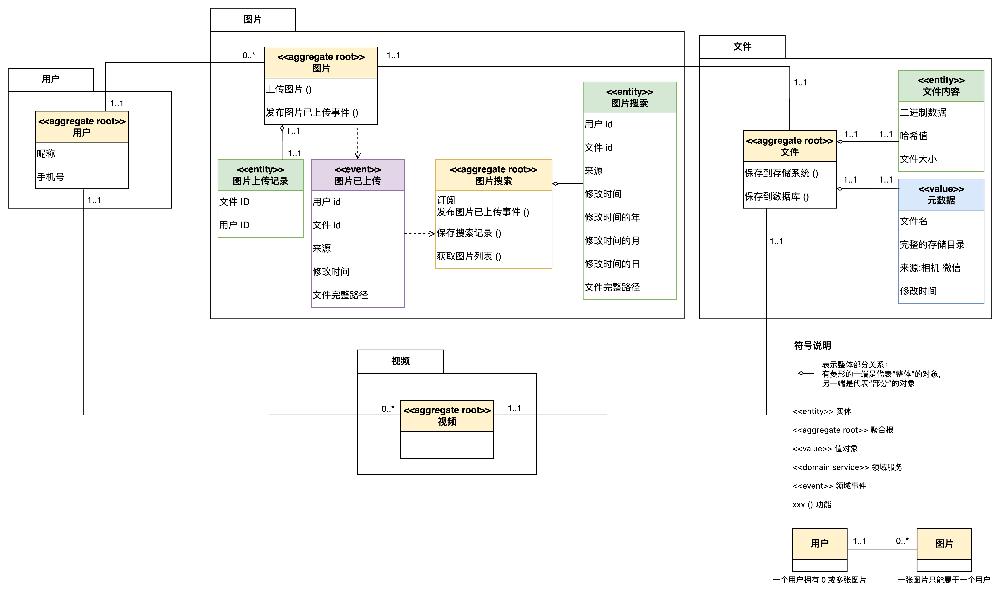

# AOE Media Server

[](https://codecov.io/gh/aoeai/aoemedia-server)
[Github](https://github.com/aoeai/aoemedia-server)
[Gitee](https://gitee.com/wyyl1/aoemedia-server)

基于领域驱动设计「DDD」的多媒体文件存储系统。支持存储各种图片。

## 项目背景

备份手机照片：将 Android 手机拍摄的照片传输至本地电脑存储。

## 领域模型



## 分层说明


Domain、Application、Adapter 处于同一个平面，Common 在另一个平面，对上面对平面进行支撑

软件架构中的一个重要原则：**代码中不稳定的部分，应该依赖稳定的部分**。所以，分层架构中越是内层，就越稳定，越是外层，相对就越容易变化

### 名词说明

- Domain：领域层，核心业务逻辑，包含领域模型
- Application：应用层，处理业务逻辑，调用领域层服务
  - 接受来自客户端的请求，调用和协调领域层的逻辑来解决问题
  - 将领域层的处理结果封装为更简单的粗粒度对象，作为对外 API 的参数。这里说的粗粒度对象一般是 DTO（Data Transfer Object），也就是没有逻辑的数据传输对象，应用层负责 DTO 和领域对象的数据转换
  - 负责处理事务、日志、权限等等横切关注点。从设计模式的角度，这一层相当于**门面**（Facade）模式
  - **应用层**本身并不包含领域逻辑，而是对**领域层**中的逻辑进行封装和编排，也可称为**应用逻辑**。封装应用逻辑的类通常**没有状态**，只有方法，一般称为**应用服务**
- Adapter：适配器，把业务功能**适配**到不同的输入输出技术
  - driving adapter：主动适配器，由外向内的适配器，如 Restful
  - driven adapter：被动适配器，由内向外的适配器，如 Repository
- Common：公共组件，包含通用的工具类、常量、异常等

### 参考资料

- [极客时间 ｜ 手把手教你落地 DDD｜ 09｜分层架构：怎样逃离“大泥球”？](http://gk.link/a/11WlS)
- [【翻译】六边形架构 | 译者：钟敬 ThoughtWorks 首席咨询师](https://zhuanlan.zhihu.com/p/113681224)

## 项目结构

```
├── adapter                      # 适配器层
│   └── driving                  # 主动适配器
│       └── restful              # RESTful API 接口
│   └── driven                   # 被动适配器
│       └── persistence          # 持久层
│           └── local_storage    # 本地存储
│           └── mysql            # 数据库存储
│       └── repository           # 仓库实现
├── application                  # 应用层
│   └── file                     # 文件
│   └── image                    # 图片
├── common                       # 公共组件
│   ├── eventbus                 # 事件总线
│   ├── os                       # 操作系统相关
│   └── test*                    # 测试工具
├── config                       # 配置管理
│   └── *.toml                   # 环境配置文件
└── domain                       # 领域层
    ├── file                     # 文件领域
    └── image                    # 图片领域
```

## 数据库


## 核心功能

### 文件存储
- 文件上传：支持多种类型文件上传
- 图片上传：支持图片格式校验和内容校验

### 图片处理
- 图片存储：按时间自动分类存储，支持EXIF信息提取
- 图片验证：支持图片格式和内容合法性校验

## 技术栈

### 后端框架
- Go 1.21：利用最新特性提升性能和开发效率
- Gin Web Framework：高性能HTTP Web框架

### 开发方法论
- 测试驱动开发「TDD」：保证代码质量和可维护性，支持即时重构，测试即文档
- 领域驱动设计「DDD」：合理划分业务边界，提高代码可维护性

## 环境配置

项目支持多环境配置，配置文件位于`config`目录：
- `config.dev.toml`：开发环境配置
- `config.test.toml`：测试环境配置
- `config.prod.toml`：生产环境配置

## 开发指南

### API 接口

[文档地址](https://apifox.com/apidoc/shared-e09cdfae-ce75-4d1e-8dcb-ca2c2a479a45)

### 测试

运行所有测试：
```bash
go test -v ./...
```

使用 gotestsum 获取详细测试报告：
```bash
# 安装gotestsum
go install gotest.tools/gotestsum@latest

# 执行测试
gotestsum
# 或使用 testname 格式
gotestsum --format testname
```

### 构建和运行

编译代码：
```bash
go build ./...
```

同步依赖：
```bash
go mod tidy
```

构建可执行文件：
```bash
go build
```

运行服务：
```bash
env APP_ENV=dev ./aoemedia-server
```

## 词汇表

| abbreviation | full name     | 中文   |
|--------------|---------------|------|
| -            | metadata      | 元数据  |
| inst         | instance      | 实例   |
| repo         | repository    | 仓库   |
| -            | persistence   | 持久化  |
| app          | application   | 应用   |
| auth         | authorization | 认证信息 |